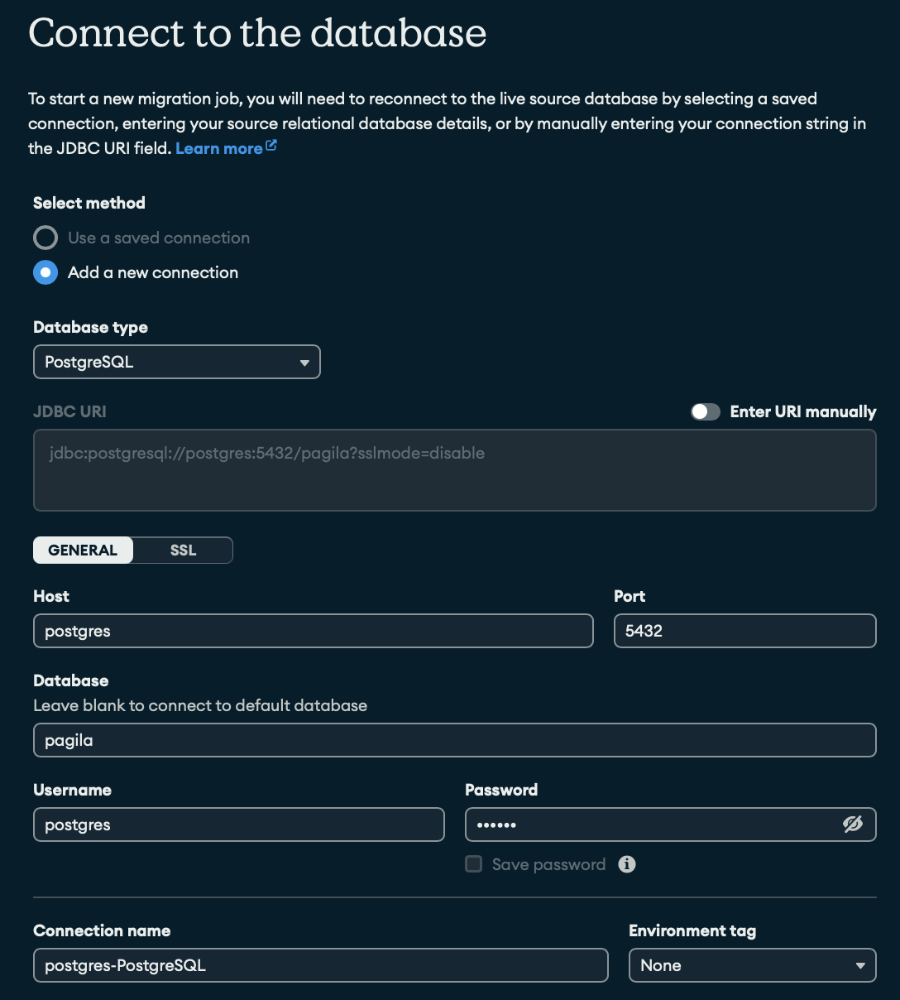

# ExploringRelationalMigrator

### Load SQL Database Files from Pagila Dataset

I'm using the Pagila Dataset from the github repo: https://github.com/devrimgunduz/pagila

```
curl -O https://raw.githubusercontent.com/devrimgunduz/pagila/master/pagila-schema.sql

curl -O https://raw.githubusercontent.com/devrimgunduz/pagila/master/pagila-data.sql
```

Now run with docker compose

```
docker-compose up
```

Connect to database:



